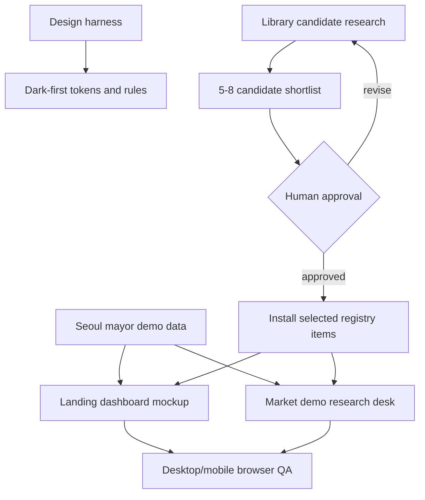

# Landing V2 Commercial Redesign Plan

## Summary

Rebuild Korealpha's landing and Seoul mayor demo as a dark-first AI research
desk for prediction markets. The plan uses shadcn/Tailwind as the base, treats
Tailark and React Bits as the primary current library candidates, and adds a
required shortlist approval gate before any external block or component is
installed.

---

## Problem Frame

The current frontend demonstrates the idea but still reads like a small project:
too little section depth, weak product visual hierarchy, and a light neutral
surface that does not match the Web3/market-intelligence category. The next
frontend pass should replace the current layout rather than preserve it.

---

## Requirements

- R1. Present Korealpha as a dark-first AI research desk for prediction markets.
- R2. Rebuild both the landing page and the Seoul mayor demo so they feel like
  one product.
- R3. Keep shadcn/ui and Tailwind CSS as the primary implementation surface.
- R4. Evaluate current community libraries before installing anything, with
  Tailark and React Bits treated as first-class candidates.
- R5. Do not install external blocks/components until a 5-8 item candidate
  shortlist has been reviewed and approved.
- R6. Use hybrid demo data: backend-ready seed structures plus a few
  source-backed evidence items.
- R7. Do not implement backend logic, live agent execution, real Polymarket
  trading, or real Arc signing in this pass.
- R8. Preserve evidence, probability, edge, decision receipt, and Arc Testnet
  proof as visible product primitives.
- R9. Keep the frontend ready for later API/backend replacement without a new
  visual redesign.
- R10. Verify desktop and mobile landing/demo layouts before calling the work
  complete.

---

## Scope Boundaries

- No real-money Polymarket order execution.
- No mainnet transaction support.
- No live Arc private-key signing from AI output.
- No backend, database, or API implementation beyond frontend-ready seed data.
- No multi-market expansion beyond the Seoul mayoral demo.
- No political campaign visuals, candidate branding, or prediction certainty.
- No light/dark theme switch in this pass.
- No broad adoption of paid/pro component libraries without explicit team
  approval.

### Deferred to Follow-Up Work

- Real agent runtime integration after the presentation/data surface is stable.
- Live Polymarket data ingestion after the seed/view model contract is proven.
- Real Arc Testnet transfer execution after receipt/action validation is
  implemented.
- Multi-market dashboard once the Seoul demo is credible.

---

## Context & Research

### Relevant Code And Patterns

- `src/app/page.tsx` currently holds the landing route and should become a thin
  route composer.
- `src/app/markets/[marketId]/page.tsx` currently holds the Seoul demo route and
  should become a thin route composer.
- `src/lib/market-data/seeded-markets.ts` and
  `src/lib/market-data/seeded-evidence.ts` hold the current market fixture data.
- `src/lib/arc/chain.ts`, `src/lib/arc/transfer.ts`, and `src/lib/arc/usdc.ts`
  provide Arc Testnet constants and mock transfer shape.
- `tests/e2e/demo.spec.ts` already verifies landing-to-demo navigation and
  mobile overflow.
- `DESIGN.md`, `docs/DESIGN_SYSTEM.md`, `.agents/skills/korealpha-design/SKILL.md`,
  and `.agents/rules/frontend.md` are the frontend harness sources that must be
  updated before implementation drifts.

### External References

- React Bits: `https://reactbits.dev/`
- React Bits GitHub: `https://github.com/DavidHDev/react-bits`
- Tailark: `https://tailark.com/`
- Tailark blocks GitHub: `https://github.com/tailark/blocks`
- Magic UI: `https://magicui.design/`
- Kokonut UI: `https://kokonutui.com/`
- coss UI / Origin UI: `https://github.com/origin-space/originui`
- shadcn/ui registry and CLI: `pnpm dlx shadcn@latest info/view/search`

### Research Findings

- Tailark is the strongest current candidate for landing section structure:
  hero, features, stats, FAQ, CTA, integrations, and logo/proof sections.
- React Bits is a strong 2026 candidate for high-impact motion and product
  polish, but it should be used selectively because some components pull heavy
  animation/rendering dependencies.
- Magic UI remains useful for restrained grid, marquee, and metric effects, but
  it is not the only modern option.
- Kokonut UI is useful for individual AI/search/card interaction ideas, not as
  the primary landing architecture.
- Origin/coss is interesting because coss UI is Base UI oriented, but its mixed
  licensing means it needs per-file review before reuse.

---

## Key Technical Decisions

- **Global dark-first theme for this MVP surface:** landing and demo are the
  only meaningful product surfaces right now, so global dark-first avoids route
  drift and matches the target category.
- **Shortlist before install:** external libraries are not installed during the
  first execution step. The implementer must first produce a 5-8 item candidate
  list with registry output, dependency notes, license notes, and recommended
  use case, then wait for approval.
- **Tailark for structure, React Bits for motion:** Tailark should inform section
  composition; React Bits should be considered for hero text, metrics, source
  loops, or product-card motion. Magic UI and Kokonut are secondary candidates.
- **Backend-ready data module:** landing mockup and demo page should read from a
  shared or closely related domain-shaped data source so API replacement does
  not require redesigning the UI.
- **Route files as composers:** page route files should compose named sections;
  section components own presentation.

---

## Open Questions

### Resolved During Planning

- **Should the implementer install libraries immediately?** No. The first work
  pass must produce a shortlist and approval report before installation.
- **Should React Bits be treated as a real candidate?** Yes. It is current,
  shadcn-compatible, and relevant, but must be screened for dependency weight
  and license constraints.
- **Should both landing and demo be rebuilt?** Yes. The demo should match the
  landing's research-desk product identity.

### Deferred to Implementation

- **Exact external components to install:** deferred until shortlist review
  because registry output, dependency weight, and fit must be inspected.
- **Exact source-backed evidence items:** deferred to the data unit, where the
  implementer will lock the selected snapshot evidence into seed data.
- **Whether landing uses the full demo view model or a derived view model:**
  deferred until the data module shape is drafted.

---

## Output Structure

This illustrates the expected file organization. The implementing agent may
adjust names if implementation reveals a clearer structure.

```text
src/components/landing/
  landing-page.tsx
  landing-hero.tsx
  landing-dashboard-mockup.tsx
  landing-proof-strip.tsx
  landing-workflow.tsx
  landing-capabilities.tsx
  landing-evidence-snapshot.tsx
  landing-agentic-proof.tsx
  landing-risk-faq.tsx
  landing-final-cta.tsx
src/components/market-demo/
  market-demo-page.tsx
  market-header.tsx
  probability-panel.tsx
  evidence-panel.tsx
  agent-analysis-panel.tsx
  decision-receipt-panel.tsx
  arc-transaction-panel.tsx
src/lib/market-data/
  seoul-mayor-demo.ts
```

---

## High-Level Technical Design

> This illustrates the intended approach and is directional guidance for review,
> not implementation specification. The implementing agent should treat it as
> context, not code to reproduce.



---

## Implementation Units

### U1. Align The Design Harness

**Goal:** Update the project design contract so future frontend work targets a
dark-first AI research desk instead of the previous neutral SaaS direction.

**Requirements:** R1, R2, R3, R8

**Dependencies:** None

**Files:**

- Modify: `DESIGN.md`
- Modify: `docs/DESIGN_SYSTEM.md`
- Modify: `.agents/skills/korealpha-design/SKILL.md`
- Modify: `.agents/rules/frontend.md`

**Approach:**

- Replace the neutral light-first SaaS direction with dark-first AI research
  desk language.
- Keep anti-drift constraints: shadcn first, semantic tokens, no campaign
  visuals, no meme-coin/cyberpunk styling, no decorative blobs or bokeh.
- Add explicit guidance that the hero visual should show a product dashboard,
  not abstract art.
- Add a rule that external component adoption must pass shortlist review first.

**Patterns to follow:**

- Existing `DESIGN.md` token contract.
- Existing `korealpha-design` skill structure.

**Test scenarios:**

- Test expectation: none -- documentation/harness alignment only.

**Verification:**

- `DESIGN.md` still lints.
- Harness docs no longer contradict the dark-first redesign plan.

---

### U2. Produce External Library Shortlist Report

**Goal:** Narrow current community libraries into an approval-ready shortlist
before installing any third-party registry item.

**Requirements:** R3, R4, R5

**Dependencies:** U1

**Files:**

- Create: `docs/research/landing-v2-library-shortlist.md`

**Approach:**

- Evaluate 5-8 candidate blocks/components across Tailark, React Bits, Magic UI,
  Kokonut UI, and any newly discovered shadcn-compatible option.
- For each candidate, record intended use, registry/install path, dependency
  impact, license notes, accessibility/style concerns, and recommendation.
- Include `pnpm dlx shadcn@latest view <item>` output summaries for registry
  candidates where available.
- Explicitly recommend which candidates to install, which to copy as structural
  inspiration only, and which to reject.
- Stop after producing the report and wait for human approval before installing
  anything.

**Execution note:** Treat this as a human-in-the-loop checkpoint. Do not install
the shortlisted components until the user approves the report.

**Patterns to follow:**

- shadcn skill rule: inspect registry output before adding components.
- Current local research under `/tmp/korealpha-landing-research` as reference
  material only.

**Test scenarios:**

- Test expectation: none -- this unit produces a research/approval artifact
  without changing runtime behavior.

**Verification:**

- The report contains 5-8 candidates.
- Each candidate has a clear accept/reject/defer recommendation.
- No new dependency or generated component file is added during this unit.

---

### U3. Install Approved Registry Components

**Goal:** Add only the external components approved after U2 and adapt them to
the project's shadcn/base-ui rules.

**Requirements:** R3, R4, R5

**Dependencies:** U2 approval

**Files:**

- Modify: `components.json`
- Modify: `src/app/globals.css`
- Modify: `src/components/ui/*`
- Create or modify: approved generated component files
- Test: `tests/e2e/demo.spec.ts`

**Approach:**

- Install only approved registry items.
- Prefer Tailark section blocks for structure and React Bits TS/TW variants for
  high-impact motion if approved.
- Review generated files before using them.
- Replace raw colors with semantic tokens where practical.
- Reject or adapt `asChild`, Radix-only assumptions, hardcoded icon libraries,
  and client boundaries that conflict with the local shadcn setup.
- Keep animation count low in the first viewport.

**Patterns to follow:**

- Existing `src/components/ui/*` component style.
- shadcn skill rules for base-ui compatibility and icon conventions.

**Test scenarios:**

- Integration: approved components compile in the Next.js app without import or
  missing dependency errors.
- Edge case: mobile viewport does not gain horizontal overflow from generated
  components.
- Error path: if an approved candidate fails compatibility review, it is omitted
  and the reason is documented instead of forcing the install.

**Verification:**

- Generated files are reviewed and adjusted.
- Lint/type/build checks pass after installation.

---

### U4. Build Backend-Ready Seoul Mayor Demo Data

**Goal:** Replace thin fixture data with a frontend-ready domain view model that
can later be backed by API responses.

**Requirements:** R6, R7, R8, R9

**Dependencies:** U1

**Files:**

- Modify: `src/lib/market-data/seeded-markets.ts`
- Modify: `src/lib/market-data/seeded-evidence.ts`
- Create: `src/lib/market-data/seoul-mayor-demo.ts`
- Test: add or update relevant unit tests if helper logic is introduced

**Approach:**

- Model market, candidate/outcome, probability, evidence, source metadata,
  agent decision, receipt, Arc transfer, and status fields.
- Add a small set of source-backed evidence snapshots with URLs and published
  dates.
- Keep all evidence phrased as signal inputs, not certainty claims.
- Preserve compatibility with existing agent/Arc schema vocabulary where useful.

**Patterns to follow:**

- Existing `src/lib/market-data/*` seed exports.
- Existing `src/lib/arc/*` constants and mock transfer shape.

**Test scenarios:**

- Happy path: landing and demo consumers can read market probability,
  Korealpha probability, edge, action, receipt, and Arc status from the data
  module.
- Edge case: missing optional source metadata does not crash render consumers.
- Integration: seeded evidence can be filtered by the Seoul mayor market id.

**Verification:**

- Data shape is typed.
- Future API replacement can target the same fields without changing section
  layout assumptions.

---

### U5. Rebuild The Landing Page

**Goal:** Replace the current landing with a dark-first commercial product
landing centered on a dashboard mockup.

**Requirements:** R1, R2, R3, R6, R8, R9, R10

**Dependencies:** U1, U3 if approved components are used, U4

**Files:**

- Modify: `src/app/page.tsx`
- Create: `src/components/landing/*`
- Test: `tests/e2e/demo.spec.ts`

**Approach:**

- Make the route file a thin composer.
- Build sections for navigation, hero/dashboard mockup, proof strip, problem,
  workflow, capabilities, source-backed evidence snapshot, agentic proof, risk
  FAQ, and final CTA.
- Use shadcn primitives for actions, cards, badges, separators, and FAQ.
- Use approved Tailark/React Bits/Magic UI pieces only where they improve the
  section without weakening readability or maintainability.
- Keep `Read Korea before the market does.` as the hero headline.

**Patterns to follow:**

- Tailark-style section composition where approved.
- Existing `buttonVariants` link pattern.
- Existing E2E landing-to-demo navigation coverage.

**Test scenarios:**

- Happy path: landing renders hero headline, product dashboard mockup, proof,
  source evidence, risk FAQ, and final CTA.
- Integration: primary CTA navigates to the Seoul mayor demo route.
- Edge case: mobile viewport has no horizontal overflow.
- Edge case: animated/text effects do not hide or replace semantic heading
  content.

**Verification:**

- Desktop and mobile screenshots show a commercial dark-first landing.
- Landing still routes judges/users into the demo.

---

### U6. Rebuild The Seoul Mayor Demo Page

**Goal:** Replace the current demo presentation with a matching research-desk
product surface.

**Requirements:** R1, R2, R6, R7, R8, R9, R10

**Dependencies:** U1, U3 if approved components are used, U4

**Files:**

- Modify: `src/app/markets/[marketId]/page.tsx`
- Create: `src/components/market-demo/*`
- Test: `tests/e2e/demo.spec.ts`

**Approach:**

- Keep the existing route and market id behavior.
- Build sections for market header, probability comparison, edge/action,
  evidence, agent analysis, decision receipt, and Arc Testnet transaction state.
- Keep testnet/paper-trade disclaimers visible.
- Match the landing's dark-first research-desk identity without turning the app
  page into another marketing page.

**Patterns to follow:**

- Existing market id lookup behavior.
- Existing Arc Testnet constants and mock transfer structure.
- Dense app layout rules in `.agents/rules/frontend.md`.

**Test scenarios:**

- Happy path: Seoul mayor route renders market title, outcome, probability,
  evidence, decision receipt, and Arc state.
- Edge case: unknown market id still follows the existing not-found behavior.
- Edge case: mobile viewport has no horizontal overflow.
- Integration: demo data displayed on the page matches the shared market data
  module.

**Verification:**

- Demo feels like the product behind the landing dashboard mockup.
- No real transaction behavior is introduced.

---

### U7. Update E2E, Browser QA, And Final Review

**Goal:** Verify that the redesigned frontend is stable, responsive, and aligned
with the plan.

**Requirements:** R10

**Dependencies:** U5, U6

**Files:**

- Modify: `tests/e2e/demo.spec.ts`
- Generated test artifacts only as ignored Playwright output

**Approach:**

- Update E2E assertions to target behavior and layout invariants instead of
  fragile decorative copy.
- Cover landing-to-demo navigation, important product primitives, and no
  horizontal overflow.
- Run browser QA for desktop and mobile landing/demo pages.
- Review the diff for accidental backend behavior or unauthorized library
  additions.

**Patterns to follow:**

- Existing Playwright test style in `tests/e2e/demo.spec.ts`.

**Test scenarios:**

- Happy path: landing CTA reaches the Seoul mayor demo.
- Happy path: demo renders receipt and Arc Testnet state.
- Edge case: `/` and `/markets/seoul-mayor-2026` do not overflow at mobile
  viewport width.
- Integration: landing and demo both render from the same demo data assumptions.

**Verification:**

- Full relevant checks pass.
- Desktop/mobile screenshots are inspected.
- Diff review confirms no real trading, mainnet, or backend work slipped in.

---

## System-Wide Impact

- **Frontend harness:** `DESIGN.md` and project rules become stricter about
  dark-first research-desk direction and library adoption gates.
- **Dependency surface:** external component adoption is controlled by the
  shortlist gate before runtime files change.
- **Data contract:** seed data becomes closer to the eventual API response shape,
  reducing future redesign pressure.
- **User-facing flow:** landing remains the entry point and demo remains the
  proof surface.
- **Unchanged invariants:** Arc remains testnet-only, Polymarket remains
  read/demo-only, and agent output does not trigger real transactions.

---

## Risks & Dependencies

| Risk                                                                  | Mitigation                                                                            |
| --------------------------------------------------------------------- | ------------------------------------------------------------------------------------- |
| External libraries add heavy dependencies or incompatible assumptions | Require U2 shortlist approval before install and reject heavy candidates by default   |
| Dark-first visual style drifts into generic crypto/cyberpunk          | Keep design harness constraints and use product dashboard visuals as the anchor       |
| React Bits license is misunderstood                                   | Record MIT + Commons Clause notes in the shortlist and avoid component redistribution |
| Tailark blocks leave a template-like feel                             | Use blocks as structure, then adapt content and visual hierarchy to Korealpha data    |
| Source-backed evidence becomes stale                                  | Label evidence as a snapshot and avoid certainty language                             |
| Rebuilding both pages expands scope                                   | Keep backend/runtime behavior out of scope and verify with focused E2E/browser QA     |

---

## Verification Plan

Run the relevant checks after implementation:

```bash
pnpm design:lint
pnpm format:check
pnpm lint
pnpm typecheck
pnpm test
pnpm build
pnpm e2e
```

Browser QA should cover:

- Landing desktop
- Landing mobile
- Demo desktop
- Demo mobile

The work is complete only when:

- No horizontal overflow is visible.
- CTA navigation works.
- Receipt, Arc Testnet, and paper-trade disclaimers are visible.
- Evidence and market data look realistic, not placeholder-like.
- Landing and demo feel like the same dark-first product.
- No unapproved external component or dependency has been added.

---

## Handoff

This plan is ready for `ce-work` only after the team accepts the planning shape.
During execution, U2 is the first human-in-the-loop gate: produce the candidate
shortlist, report it, and wait for approval before installing any external
block or component.
